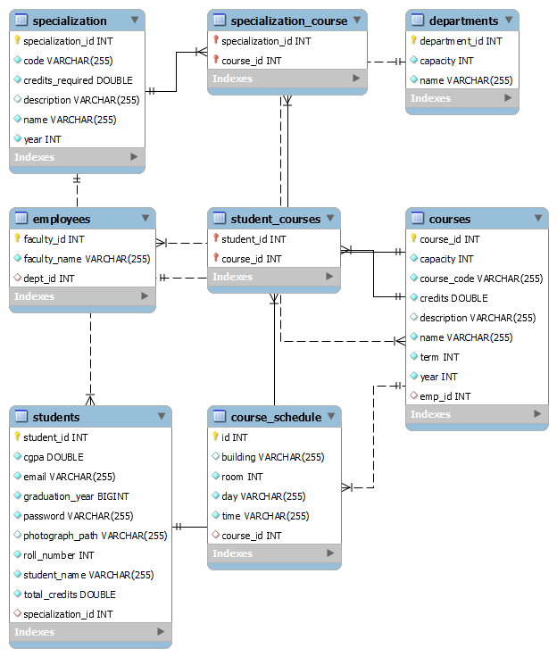

# Academia-System
This was part of a project from the Course CS513 ESD of IIIT Bangalore where we have to display the timetable of a student on the basis of the courses that particular student has selected. Also display the Course Details including the Faculty, Room Number and Specialization. 

<h2><ul>1) Login Page</ul></h2>

The Student has to login using a valid credential, proper exception handling is done to check for Authentication and Authorization.

<h2><ul> 2) Time Table Page</ul></h2>

Once the Student is validated he/she can see their own timetable for the given semester.

# DB Structure

The back end implementation is based on the given table structure.

